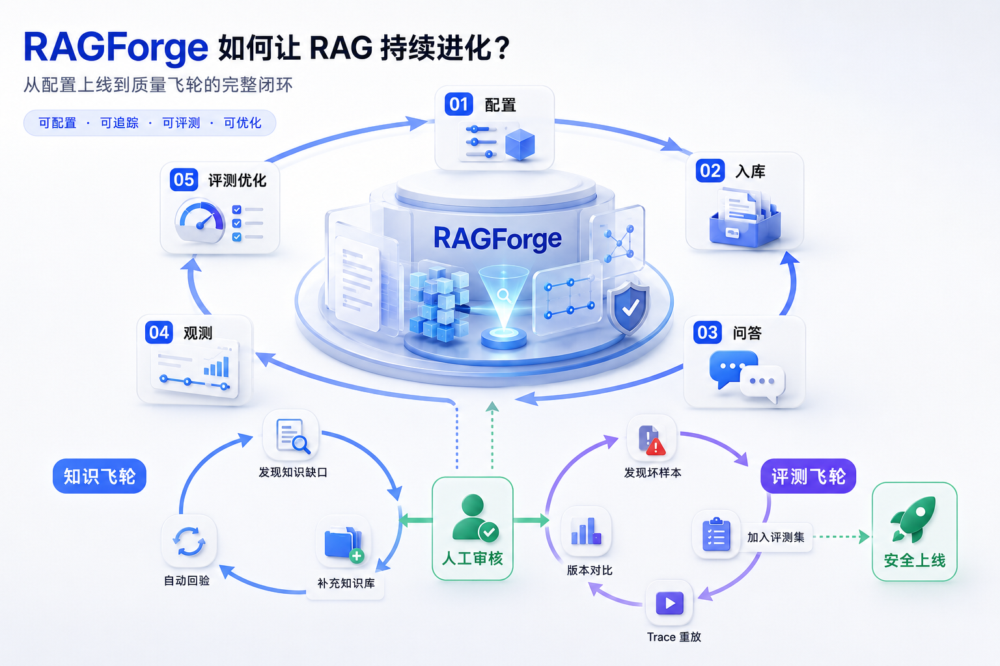
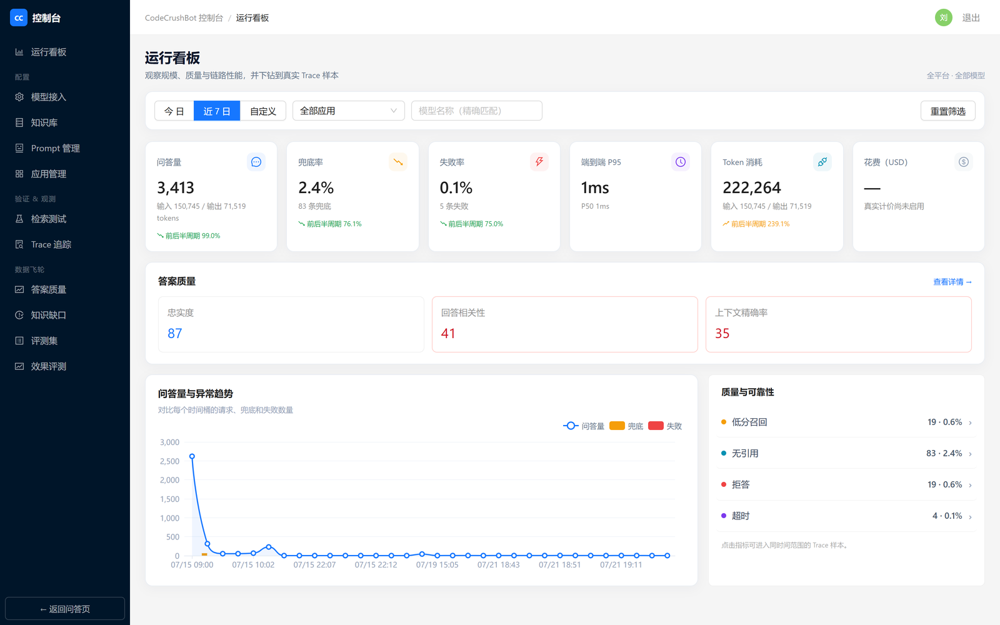
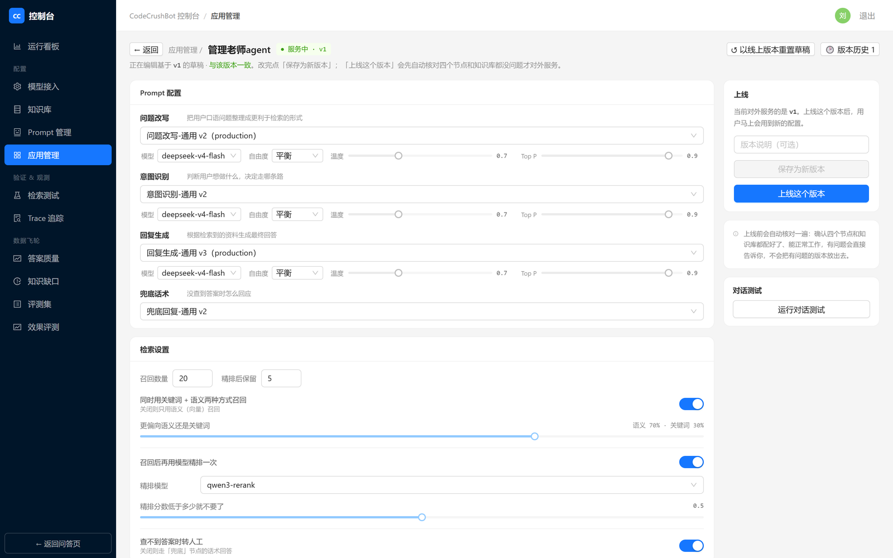
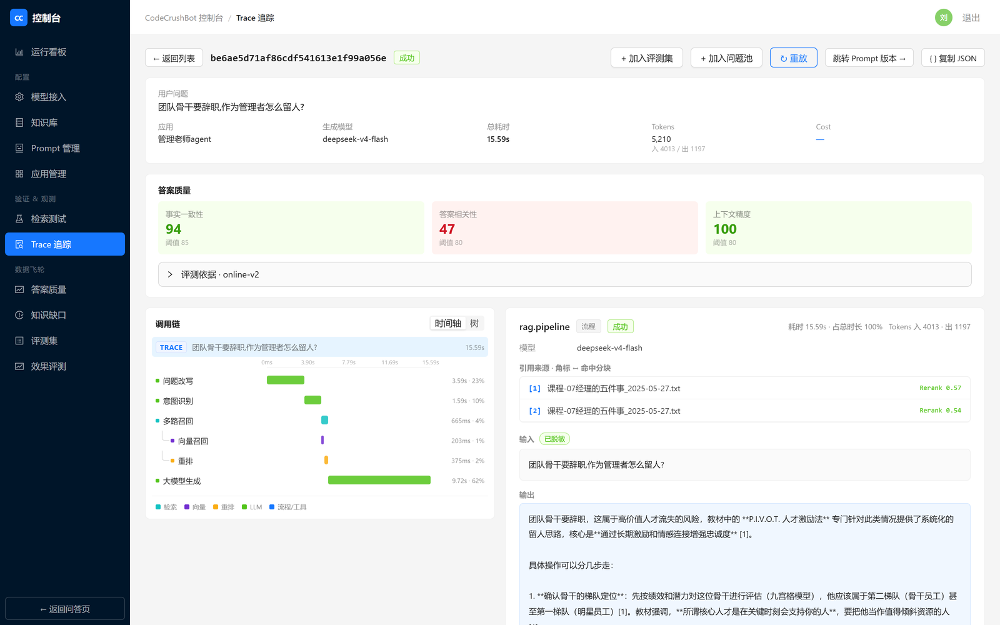
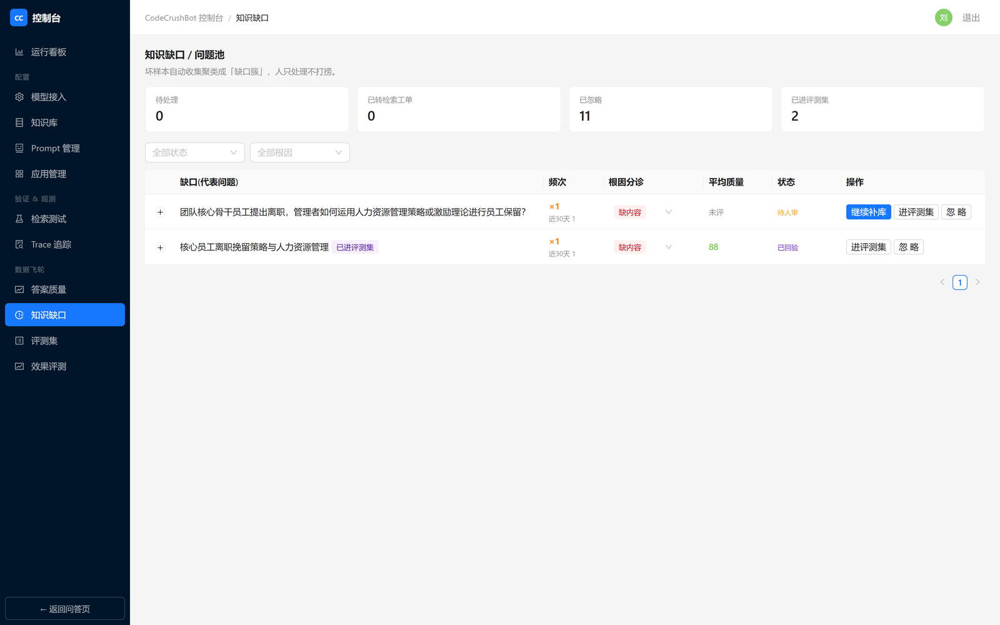

# RAGForge

RAGForge 是一个用于搭建、发布和持续优化 RAG 问答应用的平台。它覆盖从模型接入、知识入库、检索调试、Prompt 管理到应用发布、在线问答和运行追踪的完整流程。

平台的重点不是开放任意数据处理脚本，而是让一套稳定的 RAG 流程能够被配置、验证、发布和追溯。



## 主要功能

- **模型与 Prompt**：统一管理对话、向量化、重排模型及 Prompt 版本，支持连通性测试和试运行。
- **知识库**：完成文档上传、解析、分块、向量化和版本化重建，并支持切片查看与检索测试。
- **应用发布**：组合模型、知识库、Prompt 和检索参数，通过版本预演后上线或回滚。
- **在线问答**：提供独立应用入口、多轮会话、流式回答、Markdown 和引用溯源。
- **运行观测**：通过看板、Trace 和 Session 查看耗时、Token、检索结果及完整执行链路。
- **评测飞轮**：从真实流量发现坏样本，经过根因分诊、人工审核、重放、回归评测和版本对比后安全上线。

核心闭环：**配置 → 入库 → 问答 → 观测 → 评测优化 → 安全上线**。

## 界面预览

<table>
<tr>
<td width="50%"><br/><sub>运行看板 —— 问答量、兜底率、失败率与端到端延迟一屏可判，异常可下钻到 Trace 样本</sub></td>
<td width="50%"><br/><sub>应用发布 —— 组合模型、知识库、Prompt 与检索参数，上线前自动核对四节点</sub></td>
</tr>
<tr>
<td width="50%"><br/><sub>Trace 详情 —— 问题改写→意图识别→混合召回→重排→生成，逐段耗时与引用来源可见</sub></td>
<td width="50%"><br/><sub>知识缺口 —— 坏样本自动聚类成簇，人工分诊补库后自动回验</sub></td>
</tr>
</table>

## 系统架构


几个值得一提的设计选择：

- **一切外部依赖藏在端口背后**。模型、召回、入库管线、队列、对象存储、观测后端六个接缝都是端口 + 适配器，换实现只改 DI 注入：模型不绑厂商（`(type, protocol)` 是路由键，Base URL 决定打到谁家），本地 docker-compose 与云上托管跑的是同一套业务代码。
- **每一轮问答 = 一条 OTLP Trace**。埋点走 OpenTelemetry 标准语义，应用只吐 OTLP，落到哪里由 Collector 决定——换 Jaeger / Tempo / SLS，应用代码零改动。
- **埋点绝不进入问答关键路径**。Collector 或 ClickHouse 挂掉，问答照常成功；评测、入库、指标汇总同样全在关键路径之外。
- **自研薄编排，不引入 LangChain**。每个阶段就是一个显式 span，链路全程可见可控；模型原始输出经 NodeContract 校验后才进编排。
- **不可变配置版本 + production 单指针**。上线前跑真实预演，上线与回滚都只是切指针，线上 Prompt 与契约永不静默漂移。

> 图中每个端口都标了「当前 / 可换」：当前本地实现用 pg-boss 与本地卷，Kafka、OSS、Redis 是云上目标形态，接口一致。

## 本地启动

### 1. 准备环境

请先安装：

- Node.js 22 或更高版本
- pnpm 9
- Docker，并确保 Docker Compose 可用

### 2. 安装依赖

```bash
pnpm install
```

### 3. 启动依赖服务

```bash
docker compose -f infra/docker-compose.yml --profile infra up -d --wait
```

该命令会启动项目运行所需的数据库、追踪数据存储和数据采集服务。

### 4. 创建本地配置

macOS / Linux / Git Bash：

```bash
cp apps/backend/.env.example apps/backend/.env
```

PowerShell：

```powershell
Copy-Item apps/backend/.env.example apps/backend/.env
```

打开 `apps/backend/.env`，至少将 `MODEL_API_KEY_ENCRYPTION_KEY` 替换为真实的 32 字节 Base64 密钥：

```bash
openssl rand -base64 32
```

如端口、数据库地址或登录密码需要调整，也在该文件中修改。

### 5. 初始化数据库

```bash
pnpm db:migrate
pnpm db:seed
```

`db:seed` 用于写入本地演示数据。正式部署前请替换配置文件中的所有默认密码和密钥。

### 6. 启动项目

开发模式推荐直接启动全部应用：

```bash
pnpm dev
```

也可以分别启动：

```bash
pnpm --filter @codecrush/backend dev
pnpm --filter @codecrush/frontend dev
```

启动后访问：

- 管理台：<http://localhost:5173>
- 后端健康检查：<http://localhost:3000/health>
- 接口文档：<http://localhost:3000/api/docs>

## 首次使用建议

登录管理台后，建议按以下顺序完成第一套问答应用：

1. 在「模型管理」中添加对话、向量化和重排模型，并完成连通性测试。
2. 在「知识库」中创建知识库，上传文档并等待处理完成。
3. 在「检索测试」中输入问题，确认能够召回正确切片。
4. 在「Prompt 管理」中创建或调整各问答节点使用的 Prompt，并执行试运行。
5. 在「应用管理」中创建应用，绑定知识库、模型和 Prompt。
6. 保存配置版本，先进行对话测试，再执行上线检查并发布。
7. 打开应用的问答入口进行多轮问答。
8. 在「Trace 追踪」和「运行看板」中查看执行过程、耗时、Token、召回结果和异常信息。

## 常用命令

| 命令 | 作用 |
| --- | --- |
| `pnpm dev` | 启动全部应用的开发模式 |
| `pnpm build` | 构建全部应用和公共包 |
| `pnpm test` | 运行全部测试 |
| `pnpm lint` | 检查代码规范和依赖边界 |
| `pnpm db:migrate` | 应用数据库迁移 |
| `pnpm db:seed` | 初始化本地演示数据 |
| `pnpm observability:verify` | 验证完整追踪链路，需先启动后端及依赖服务 |
| `docker compose -f infra/docker-compose.yml down` | 停止依赖服务并保留数据 |
| `docker compose -f infra/docker-compose.yml down -v` | 停止依赖服务并删除本地数据卷 |

## 构建后运行

```bash
pnpm build
pnpm --filter @codecrush/backend start
pnpm --filter @codecrush/frontend preview
```

正式部署前，请替换所有默认密码和密钥，并根据部署环境配置数据库、追踪服务、文件存储地址及访问控制。

## 更多文档

- [系统设计](docs/design/001-rag-platform-architecture.md)
- [实现路线图与交付状态](docs/design/002-implementation-roadmap.md)
- [代码组织约定](docs/design/003-code-organization.md)
- [AI 编码助手工作指南](AGENTS.md)

## License

内部项目，暂未指定 License。
